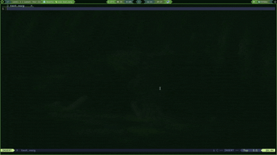
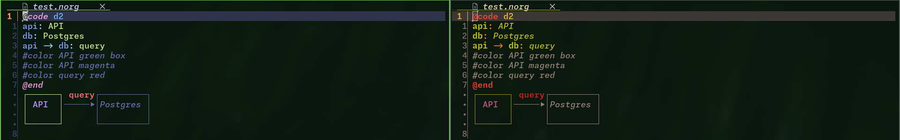
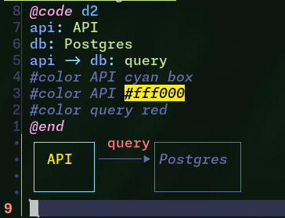
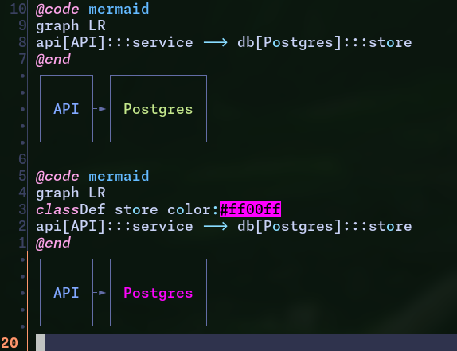
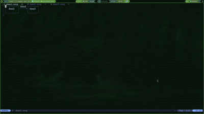
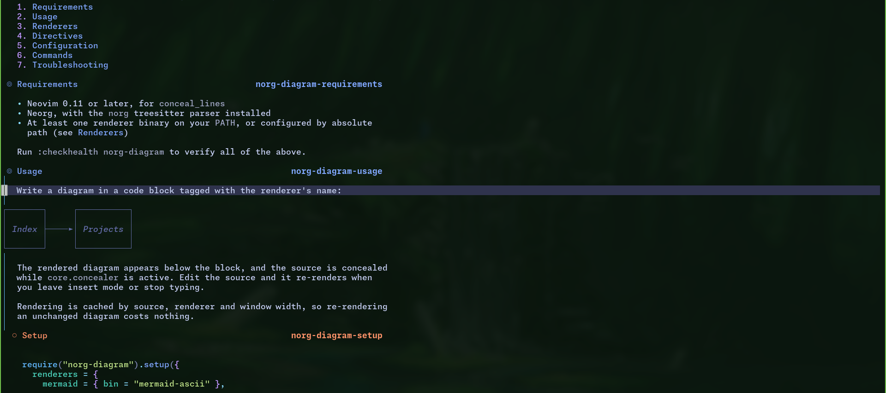

# norg-diagram.nvim

Render mermaid, d2 and graph-easy diagrams as text inside norg buffers.

No image protocol involved: diagrams are drawn with box-drawing characters as
virtual lines, so they work over ssh, inside tmux, and in any terminal. They
scroll, fold and search like the rest of the buffer.



## Features

- **Three renderers.** mermaid (via `mermaid-ascii`), d2, and graph-easy, each
  configurable and easy to extend with more.
- **Theme-aware colors.** Nodes take colors from your colorscheme's palette, so
  diagrams match whatever theme you're running.
- **Box colouring.** Colour a label, or the whole box around it, or both in
  different colours.
- **Neorg links on nodes.** Mark a node as a link to another file or heading,
  and follow it.
- **Width-aware.** Diagrams are rendered to fit your window and re-render on
  resize.
- **Concealed source.** The block collapses to just the diagram, and follows
  `:Neorg toggle-concealer`.



## Requirements

- Neovim 0.11+ (for `conceal_lines`)
- [Neorg](https://github.com/nvim-neorg/neorg) with the `norg` treesitter parser
- At least one renderer:
  - [mermaid-ascii](https://github.com/AlexanderGrooff/mermaid-ascii)
  - [d2](https://d2lang.com) 0.7.1+ (0.9.0+ for the `tala` layout)
  - [Graph::Easy](https://metacpan.org/pod/Graph::Easy)

Run `:checkhealth norg-diagram` after installing.

## Installation

### lazy.nvim

```lua
{
  "DuckTapeMan35/norg-diagram.nvim",
  ft = "norg",
  opts = {},
}
```

### Nix

The flake exposes an overlay providing `vimPlugins.norg-diagram`:

```nix
{
  inputs.norg-diagram.url = "github:DuckTapeMan35/norg-diagram.nvim";

  # ...
  nixpkgs.overlays = [ inputs.norg-diagram.overlays.default ];
}
```

then add `pkgs.vimPlugins.norg-diagram` to your plugin list.

## Usage

Write a diagram in a code block tagged with the renderer's name:

```norg
@code mermaid
graph LR
A[Index] --> B[Projects]
@end
```

The rendered diagram replaces the block. Edit the source and it re-renders when
you leave insert mode.

### Colours

Colour a label, a box, or both:

```norg
@code d2
api: API
db: Postgres
api -> db: query
#color API green box
#color API black
#color query red
@end
```

Colour names resolve against your colorscheme's terminal palette, so `green`
means your theme's green. You can also name a highlight group, or give a
literal `#rrggbb`.



For mermaid, `:::class` syntax works too, with class names mapped to highlight
groups:

```norg
@code mermaid
graph LR
api[API]:::service --> db[Postgres]:::store
@end
```



### Links

Mark a node as a link to a Neorg target:

```norg
@code mermaid
graph TD
A[Index] --> B[Projects]
%%link Index {:index:}
%%link Projects {:projects/overview:** Status}
@end
```

Linked labels are highlighted inline. To follow one, open the diagram in a
float with `:NorgDiagramFloat` — `<Tab>` cycles between nodes and `<CR>`
follows the link under the cursor.



## Configuration

Defaults:

```lua
require("norg-diagram").setup({
  renderers = {
    mermaid = { bin = "mermaid-ascii" },
    d2 = { bin = "d2" },
    easy = { bin = "graph-easy" },
  },

  max_width = "window",   -- number | "auto" | "window" | nil
  position = "replace",   -- "replace" | "after"
  conceal = true,
  fold = true,

  classes = {},           -- ["className"] = "HlGroup"
  box_color = true,
  hl = "Comment",
  edge_hl = "Comment",
  err_hl = "DiagnosticError",
  link_hl = "@neorg.links.description",

  debounce_ms = 300,
  timeout_ms = 5000,
  enabled = true,
})
```

See `:help norg-diagram-config` for every option, and
`:help norg-diagram-renderers` for the per-renderer ones.

## Commands

| Command                  | Description                                  |
| ------------------------ | -------------------------------------------- |
| `:NorgDiagramRender`     | Re-render the current buffer                 |
| `:NorgDiagramToggle`     | Turn rendering on or off                     |
| `:NorgDiagramClearCache` | Drop cached renders and re-render            |
| `:NorgDiagramFloat`      | Open the diagram under the cursor in a float |

## Documentation

`:help norg-diagram`. The help file is written in Norg, so opening it renders
its own example diagrams.



## Acknowledgements

- [mermaid-ascii](https://github.com/AlexanderGrooff/mermaid-ascii) does the hard part for mermaid
- [d2](https://d2lang.com) for its ASCII renderer
- [graph-easy](https://metacpan.org/pod/Graph::Easy) for the graph-easy renderer
- [Neorg](https://github.com/nvim-neorg/neorg), the best markup language
